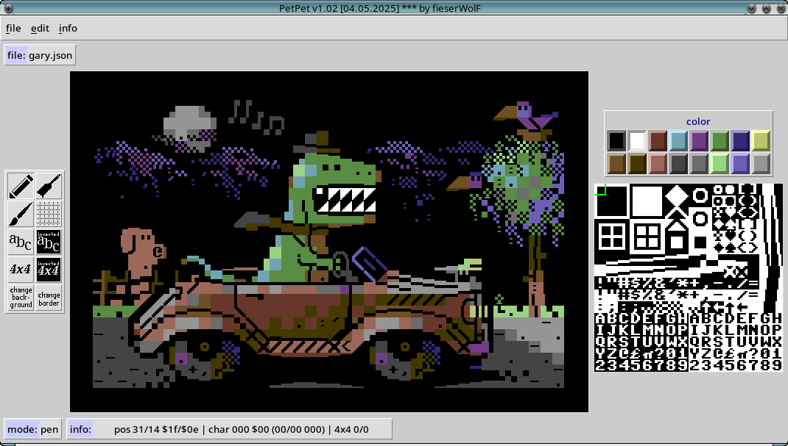

# PetPet

PetPet is a PETSCII editor for Commodore 64 computers.
It runs on 64 bit versions of Linux, MacOS, Windows and other systems supported by Python. 




# Why PetPet?

reason | description
---|---
open source | easy to modify and to improve, any useful contribution is highly welcome
portable | available on Linux, MacOS, Windows and any other system supported by Python3


# Commandline options

	PetPet v1.00 REVISION PARTY 2025 [19.04.2025] *** by fieserWolF
	usage: petpet.py [-h] [-p PETSCII_FILENAME] [-c CONFIG_FILENAME] [-f FONT_FILENAME]

	This is a PETSCII editor. Press F1 for help in the program.

	options:
	  -h, --help            show this help message and exit
	  -p, --petscii_file PETSCII_FILENAME
							petscii filename (.json)
	  -c, --config_file CONFIG_FILENAME
							name of configuration file (.json)
	  -f, --font_file FONT_FILENAME
							name of font (2048 bytes)

	Example: ./petpet.py -p gfx.json -c config.json -f font.bin


# File Formats

The PETSCII image is natively stored as a json file. There is also a binary import and export.

## PetPet JSON format

object | key | type | value
---|---|---|---
info | program | string | "PetPet"
info | version | string | e.g. "1.0"
settings | background | number | color 0-15
settings | border | number | color 0-15
settings | font | string | filename of font
settings | grid | boolean | True or False
. | char | array of 1000 numbers | characters (0-255)
. | color | array of 1000 numbers | colors (0-15)


## binary format

offset | size in bytes | value
---|---|---
0 | 1000 | characters
1000 | 1000 | colors
1001 | 1 | background color
1002 | 1 | border color


## PETSCII-EDITOR binary format

offset | size in bytes | value
---|---|---
0 | 2 | start address $3000 (low, high)
2 | 1000 | characters
1002 | 1 | border color
1003 | 1 | background color
1004 | 1 | $d018 value ($14 or $16)
1029 | 1000 | colors


# Author

* fieserWolF/Abyss-Connection - *initial work* - [https://github.com/fieserWolF](https://github.com/fieserWolF) [https://csdb.dk/scener/?id=3623](https://csdb.dk/scener/?id=3623)

# Acknowledgements

* Logiker for testing and feature ideas
* Mermaid for the still wonderful PETSCII entitled "Gary"
# Getting Started

## Run the Python3 script directly

Download _petpet.py_ and the whole _code_ and _resource_ - directory into the same folder on your computer.

### Prerequisites

At least this is needed to run the script directly:

- python 3
- python tkinter module
- python json module
- python "argparse" library


Normally, you would use pip like this:
```
pip3 install tk argparse json
```

On my Debian GNU/Linux machine I use apt-get to install everything needed:
```
apt update
apt install python3 python3-tk
```


# Changelog

## Future plans

Any help and support in any form is highly appreciated.

If you have a feature request, a bug report or if you want to offer help, please, contact me:


[http://csdb.dk/scener/?id=3623](http://csdb.dk/scener/?id=3623)
or
[wolf@abyss-connection.de](wolf@abyss-connection.de)


## Changes in 1.01

* improved selection box
* added write-mode
* gui improvements


## Changes in 1.0

released on REVISION PARTY 2025

- initial release
# License

_PetPet is a PETSCII editor for Commodore 64 computers._

_Copyright (C) 2025 fieserWolF / Abyss-Connection_

This program is free software: you can redistribute it and/or modify it under the terms of the GNU General Public License as published by the Free Software Foundation, either version 3 of the License, or (at your option) any later version.

This program is distributed in the hope that it will be useful, but WITHOUT ANY WARRANTY;
without even the implied warranty of MERCHANTABILITY or FITNESS FOR A PARTICULAR PURPOSE.
See the GNU General Public License for more details.

You should have received a copy of the GNU General Public License along with this program.
If not, see [http://www.gnu.org/licenses/](http://www.gnu.org/licenses/).

See the [LICENSE](LICENSE) file for details.

For further questions, please contact me at
[http://csdb.dk/scener/?id=3623](http://csdb.dk/scener/?id=3623)
or
[wolf@abyss-connection.de](wolf@abyss-connection.de)

For Python3, The Python Imaging Library (PIL), Tcl/Tk and other used source licenses see file [LICENSE_OTHERS](LICENSE_OTHERS).


